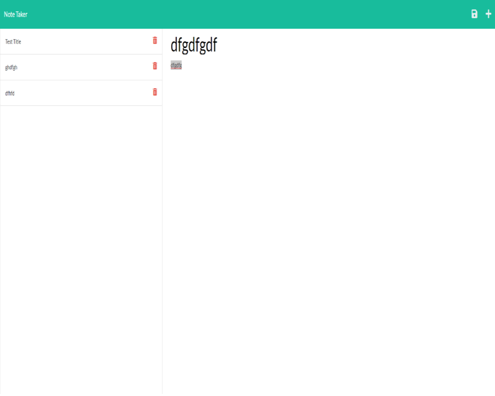

# Note Taker

  

  ## Table Of Contents
  * [Description](#description)
  * [Installation](#installation)
  * [Usage](#usage)
  * [License](#license)
  * [Question(s)](#questions)

  ## Description
  When completed this Note Taker will allow the user to create, store, and delete notes regarding any content on the app. The stored notes will be there even if they refresh the page or close the app or browser.

  ## Installation
  This app is deployed through Heroku and requires express.

  ## Usage
  The user will click the get started button. They will then be presented with a page that contains a note title, an area for the note text, and on the left there will be previously saved notes. You will be able to save the current note you're on by clicking the save icon. You'll also be able to delete past notes by clicking the delete icon next to them.

  ## License
  https://opensource.org/licenses/ISC

  ## Question(s)
  If you have any questions about this project you can reach me at:
  * GitHub: https://github.com/KJKhalil
  * Email: khalil.j.khalil@hotmail.com

  ## Screenshot
  
